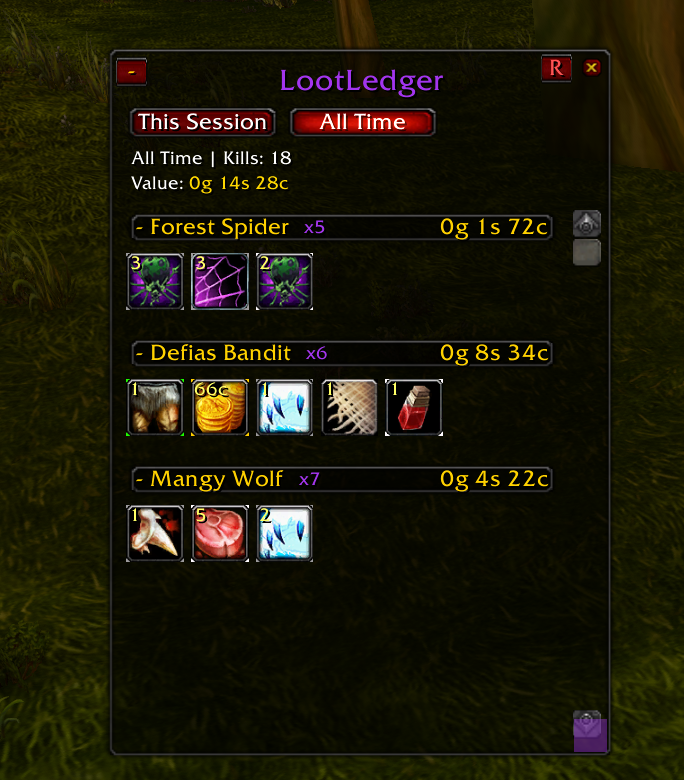
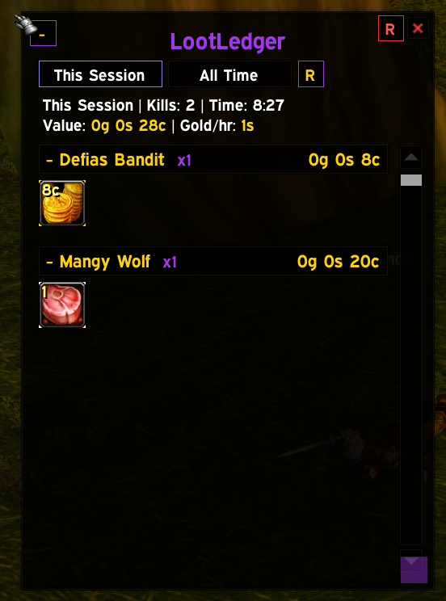
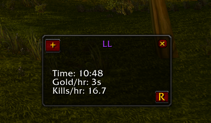
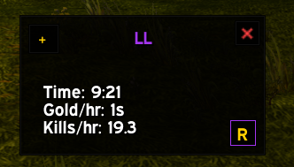

# LootLedger

A gold/hour and loot tracker for vanilla WoW 1.12 (Turtle-based servers). Tracking runs continuously in the background - every kill, every item, every coin drop is valued and rolled into a live gold/hour rate, alongside a persistent per-mob loot history in a window styled after RuneLite's OSRS Loot Tracker.

| Default skin | pfUI skin |
| --- | --- |
|  |  |
|  |  |

## Install

1. Copy the `LootLedger` folder into `Interface/AddOns/`
2. Make sure **Aux** (`aux-addon`) is installed and enabled - LootLedger reads its auction price data directly
3. Enable LootLedger at the character select addon list

If **pfUI** is also installed, the Loot Tracker window automatically matches its look - no configuration needed.

## Usage

Tracking starts automatically on login. Nothing to turn on, and This Session keeps running across logout and `/reload` - it only resets when you use Reset All or Restart Session.

- `/ll` - opens the Loot Tracker window, or click the minimap button
- `/ll loot` - preview the current stretch without resetting it
- `/ll status` - quick progress check
- `/ll debug` - verify Aux's price data is readable
- `/ll debugprice <itemID>` - shows exactly how a price was computed
- `/ll help` - full command list

### The Loot Tracker window

Lists every mob you've tracked a kill for, each with a kill count, total value, and a grid of item icons (hover for a tooltip). Toggle between **This Session** and **All Time** - whichever is active is highlighted. This Session also shows a live gold/hour rate next to its totals.

- Coin looted shows up in the grid as its own entry, sorted by value like any other drop
- Items you didn't personally win still appear, greyed out, excluded from the total
- Click a mob's header to collapse or expand just that mob's loot grid; right-click it to reset just that mob
- Right-click an item icon to filter it out entirely - it stops being tracked and disappears from existing history too
- The small **R**/**V** button (top left, next to collapse) toggles mob ordering between most-recently-killed and highest-value
- Drag the bottom-right corner to resize the window
- The small **O** button opens **Options** - toggle including disenchant value in pricing, and see/remove everything currently filtered
- The small **R** by the close button is **Reset All** - wipes everything, with a confirmation prompt
- The small **R** next to All Time is **Restart Session** - resets the current stretch's clock without touching All Time history (only shown while viewing This Session)
- Collapse the whole window (`-` button, top left) to a compact Time / Gold-per-hour / Kills-per-hour readout

## How pricing works

Each item is valued at whichever is higher:

1. **Vendor sell price**, read directly from the client
2. **Aux's market value** - the same weighted-median calculation Aux itself uses (recent scans weighted higher, decaying over time), not just the latest scan or a flat average
3. **Expected disenchant value** (optional, off by default - enable in Options) - Aux's own real vanilla disenchant-yield data and pricing, not a guess

The source used ("vendor", "AH", or "DE") is shown next to each line.

## Loot attribution

Loot is credited to whichever mob you killed that matches the corpse you're looting. In a raid, your target usually isn't still the right corpse by the time a delayed loot message arrives, so attribution falls back to whichever tracked mob you killed most recently. This can occasionally misattribute if you kill two different tracked mobs back-to-back before an earlier kill's loot arrives, but it's close enough to be useful in group and raid content, not just solo.

Group/raid Need or Greed rolls are handled too - only the actual result counts, not the rolling itself:

- If you win the roll, it's credited to you like any other pickup
- If someone else wins, it shows up greyed out under that mob (visible, but excluded from your total) instead of being discarded
- The roll process itself (each person's individual roll, "X has selected Greed", etc.) is ignored entirely, so a 5-person roll on one item reads as 1 item dropped, not 5

Soul Shards are filtered out entirely - they have no resale value and just clutter the list. Any item can be filtered the same way by right-clicking its icon in the Loot Tracker window.

## License

MIT - see [LICENSE](LICENSE).
